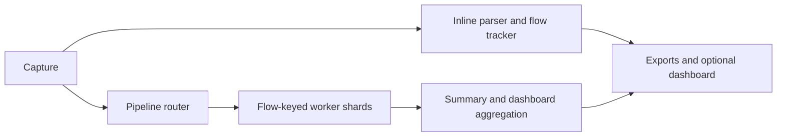

# Design

NetScope reads packets from libpcap, decodes supported headers, updates bidirectional flow state, and optionally sends bounded summaries to the local dashboard. Inline processing is the default; the sharded pipeline is opt-in with `--pipeline` or a nonzero `--workers` value.

## Processing modes



Offline PCAP input uses bounded backpressure: a full worker queue slows file reading so input frames are not discarded. Live dispatch stays nonblocking and counts queue drops separately from kernel/libpcap and interface drops. Pipeline shutdown drains workers before final summaries and flow exports are written. Pcap output records capture-thread input before worker dispatch.

The router hashes the canonical full flow tuple. Packets in one flow stay together, but unrelated flows to the same destination can reach different workers. Anomaly detection therefore runs in inline mode only; pipeline runs reject anomaly-enabled configuration before capture. In pipeline mode, the configured `flow.max_flows` budget is divided across shards. A busy shard can evict early while another has unused capacity, and pruning can temporarily overshoot during a burst.

## Flow model

A flow key is `(protocol, endpoint_a, endpoint_b)`, with endpoints ordered canonically so both directions update one record. Each flow stores first and last timestamps, directional packet and wire-byte totals, and a derived average bit rate. TCP tracking can add inferred connection state, client direction, RTT samples, retransmission counts, and out-of-order counts. These are packet-level observations: NetScope does not reassemble TCP streams, and lost or reordered packets can affect the inferred state.

When RTT, retransmission, and out-of-order analysis are all disabled, NetScope uses a compact scale-mode table. This reduces per-flow bookkeeping; it does not make the flow limit a strict instantaneous cap because pruning is periodic.

## Protocol support and depth

| Layer | Implemented depth | Boundaries |
| --- | --- | --- |
| Link | Ethernet II, 802.1Q VLAN, stacked 802.1ad QinQ, Linux SLL, loopback NULL/LOOP, raw IP | Other datalink types are reported unsupported. |
| Network | ARP, IPv4, IPv6 | IPv6 extension walking is bounded to 16 headers. Non-initial IPv4 fragments are skipped for flow tracking. |
| Transport | TCP, UDP, ICMP, ICMPv6 | TCP/UDP headers are validated; malformed transport is accounted for separately from link/network decode. |
| Application | DNS question/answer fields on UDP/53; TLS ClientHello SNI when recognized | DNS inspection is narrow. SNI requires a complete ClientHello in one packet; ECH or TCP segmentation can hide it. |

Protocol recognition does not imply full dissection. Use Wireshark/TShark when broad protocol decoding or general TCP stream reassembly is needed.

## Anomaly heuristics

The optional detectors look for source-diverse initial SYN bursts to one target and bursts of SYN probes across distinct destination ports or hosts. Their time windows, thresholds, and cooldowns live under `[analysis.anomalies]`; the checked-in [`anomaly-demo.toml`](../examples/anomaly-demo.toml) uses deliberately low values for synthetic examples. Threshold crossings are alerts for investigation, not proof of malicious intent. Benign monitoring and inventory scans can satisfy the same rules.

Alerts are written as JSON Lines with a schema version, event time, kind, available source/target identifiers, window and threshold context, observed counts, and description. Anomaly state expires by event time and is periodically swept to bound stale queues and cooldown entries.

## Dashboard

The optional dashboard runs in a separate async runtime and binds to `127.0.0.1:8080` by default. It serves `/`, WebSocket updates at `/ws`, health at `/api/health`, and Prometheus text at `/metrics`. Packet samples are bounded and can be reduced with `web.sample_rate`; dashboard event delivery is best-effort and may drop updates under load without blocking packet capture. Packet details are available only while the packet remains in the ring buffer.

The embedded UI uses the vendored Chart.js asset. TLS and Basic auth are configurable, but a remote bind should use both so captured data and credentials are protected. The configured `web.payload_bytes` limits stored packet data for the inspector; it does not change capture snaplen or pcap output.

## Contributor notes

| Area | Location |
| --- | --- |
| Capture, CLI, and configuration | `src/capture/`, `src/cli.rs`, `src/config.rs` |
| Protocol decoding and packet formatting | `src/protocol/`, `src/packet_format.rs` |
| Flow state and exports | `src/flow/` |
| Anomaly analysis and pipeline | `src/analysis/`, `src/pipeline/` |
| Dashboard server and embedded UI | `src/web/`, `web/static/` |
| Small synthetic PCAPs and investigations | `scripts/generate_examples.py`, `examples/` |

For a protocol change, add a bounded parser under `src/protocol/`, cover a meaningful valid or malformed boundary, and update the example manifest only if the fixture set changes. For a user-visible behavior change, update the relevant reference/design page and preserve the final-summary accounting contract. The normal quality gates are:

```sh
cargo fmt -- --check
cargo clippy --locked --all-targets -- -D warnings
cargo test --locked
cargo build --locked --release
python3 scripts/generate_examples.py --check
```

The benchmark runners and evidence format are described in [Performance](performance.md). Live replay and long performance jobs are intentionally separate from ordinary CI.
