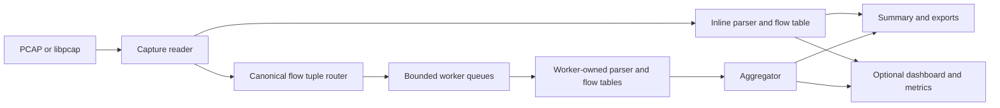

# Design

NetScope reads a PCAP or a live libpcap source, parses supported headers, updates bidirectional TCP/UDP flows, and emits summaries and optional views. Inline processing is the default. Worker sharding is an opt-in live/throughput path with explicit limits.

## Processing modes



Inline mode owns one flow table and one global anomaly detector. Pipeline mode routes both directions of a flow to the same worker, then merges worker summaries at shutdown. Offline reads block when queues fill, so file input is processed with backpressure. Live capture dispatch remains nonblocking; queue-full frames are counted as application dispatch drops. A capture PCAP is written before pipeline dispatch and can therefore contain frames absent from worker-side flows.

`flow.max_flows` is a total pipeline budget split among workers. A busy shard may evict flows while another has spare quota, and pruning occurs at most once per second, so a burst can temporarily exceed a shard's share. If the budget is below the requested worker count, NetScope reduces the active worker count so each shard receives a positive quota.

Inline offline flow expiry uses packet timestamps. Pipeline workers also prune against the current wall clock on idle ticks, even for offline input; an older trace can therefore lose retained flows if a worker becomes idle during a longer run. For offline investigations that need capture-time expiry, use inline mode. To disable timeout removal in either mode, use `--flow-timeout-s 0`; the flow budget still applies.

Pipeline mode rejects enabled anomaly detection before opening the source. The router hashes the full canonical flow tuple, so sources targeting one destination may reach different shards; per-worker thresholds would change the detector's meaning.

## Decode and tracking scope

| Input layer | Recognized data | Flow or payload behavior |
| --- | --- | --- |
| Ethernet, Linux SLL v1, NULL/LOOP loopback, raw IP | Link type and supported inner network headers; Ethernet supports up to four 802.1Q/802.1ad tags. | Other link types, including SLL2, are reported unsupported. |
| ARP | Address and operation fields. | Decoded, but no flow is created. |
| IPv4 / IPv6 | Address, lengths, and network fields; IPv6 walks at most 16 common extension headers. | Non-initial fragments are skipped. There is no fragment reassembly. |
| TCP / UDP | Transport header fields and ports. | Bidirectional flows with directional counts. Malformed supported headers are classified separately. |
| ICMP / ICMPv6 | Type/code and echo identifier/sequence when present. | Decoded, but no flow is created. |
| DNS | UDP involving port 53; first query question and response section counts. | Packet-level decode only; no DNS-over-TCP or encrypted DNS inspection. |
| TLS | Best-effort SNI from a complete ClientHello in one TCP payload. | No TCP stream reassembly; split ClientHello messages can be missed and ECH can conceal SNI. |

TCP state, client direction, RTT, retransmission, and out-of-order fields are inferred from captured packets. They do not reconstruct a TCP byte stream. Capture-file support is limited by libpcap plus the link types above; classic PCAP is the checked-in and reproducible baseline. PCAPNG support is broader but has only a minimal single-interface Ethernet verification in the current evidence.

The final run summary distinguishes frames read, packets parsed, network and transport headers recognized, parse errors, malformed transports, unsupported packets, flows, alerts, worker accounting, and drop sources. Unavailable counters are `null`, not zero. See [Reference](reference.md) for output contracts.

## Anomaly semantics

The two detectors are configurable heuristics, not signature-based intrusion detection:

- **SYN flood:** counts initial TCP SYN observations in a sliding time window and requires both the configured SYN count and unique-source threshold for a target.
- **Port scan:** counts distinct destination ports and hosts observed from a source within its configured window; either configured unique-target threshold can fire the alert.

Each detector has a per-key cooldown. Expired observations and cooldowns are pruned even when a key becomes inactive. Out-of-order capture timestamps use a monotonic event-time watermark so state does not move backward. A benign scanner, inventory check, or traffic burst may meet a threshold; a PCAP alone cannot establish intent, service impact, or whether a handshake completed.

## Dashboard and security

The optional dashboard runs in a dedicated server thread and consumes inline updates or aggregated pipeline frames. It offers `/`, `/ws`, `/api/health`, and `/metrics`. Packet samples are capture-wide, while detail data is kept in a bounded ring buffer. `sample_rate = 0` disables packet samples without disabling stats or alerts. Chart.js is vendored so the dashboard works offline; keep its license alongside the asset.

The server defaults to `127.0.0.1`. For remote access, enable TLS and authentication as shown in [Reference](reference.md#remote-dashboard). Basic auth covers every dashboard endpoint, including `/metrics` and the WebSocket handshake; without TLS, credentials travel over cleartext HTTP.

## Development checks

The focused project gates are:

```sh
cargo fmt -- --check
cargo clippy --locked --all-targets -- -D warnings
cargo test --locked
cargo build --locked --release
python3 scripts/generate_examples.py --check
python3 scripts/perf/test_workloads.py
python3 scripts/perf/test_live_capture.py
```

Add coverage for observable behavior or a concrete regression risk. Keep long performance runs and privileged live replay outside ordinary CI.
