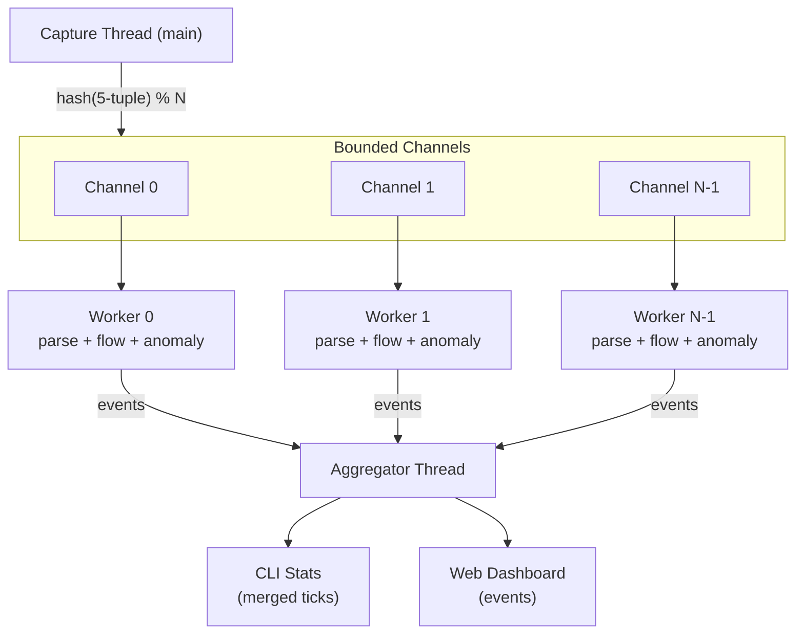

# Sharded Pipeline

When enabled (`--pipeline`), NetScope splits packet processing across multiple worker threads for higher throughput on multi-core machines. The capture thread does minimal work -- it reads packets from libpcap, computes a fast 5-tuple hash from raw bytes, and dispatches each packet to the appropriate shard via bounded crossbeam channels.

```bash
sudo netscope --pipeline --quiet --stats --top-flows 5
```

## Architecture



### How It Works

1. **Capture thread** reads raw packets from libpcap on the main thread.
2. **Shard routing** extracts the 5-tuple (protocol, src IP, src port, dst IP, dst port) from raw bytes with lightweight header walking (including common IPv6 extension headers) -- no full parse required. The hash determines which worker receives the packet: `shard = hash(5-tuple) % num_workers`.
3. **Workers** each own their own `FlowTracker` and `AnomalyDetector`. Parsing, flow tracking, TCP analysis, and anomaly detection all happen lock-free within each shard.
4. **Aggregator** collects per-shard tick data, merges it into global statistics, and forwards events to the CLI and web dashboard.
5. **Web server** batches each merged tick with sampled packets and alerts into a single websocket `frame`, and replays the latest frame after reconnect or lag recovery.

For dashboard top flows, each worker uses a fixed-size streaming heavy-hitters tracker during the tick window to identify candidate flows without scanning the entire flow table every frame. Before emitting the shard tick, the worker resolves exact byte deltas for those candidates from its `FlowTracker`, so displayed web rates remain exact even though candidate selection is approximate. When deep TCP analysis is disabled, this candidate path now uses the same compact internal flow-key representation as scale-mode flow storage.

The heavy-hitter limit is sized from `max(stats.top_flows, web.top_n)`. This lets the CLI print more flows than the dashboard displays, while the aggregator still truncates the dashboard payload separately to `web.top_n`.

All packets for the same 5-tuple always land on the same shard, guaranteeing correctness for flow tracking and TCP state machines.

### Canonical Ordering

Shard routing uses canonical endpoint ordering (always hashing `(min, max)` regardless of packet direction) so that both directions of a flow map to the same shard.

## Configuration

| Key                | Default    | Description                                                                                                     |
| ------------------ | ---------- | --------------------------------------------------------------------------------------------------------------- |
| `workers`          | `0` (auto) | Number of worker shards. Auto mode uses half of CPU count, clamped to 1..8.                                     |
| `channel_capacity` | `4096`     | Per-shard bounded channel size. Live capture drops and counts a packet if its shard queue is full. Offline PCAP processing waits for queue space so file input is not dropped. |

Set in the `[pipeline]` section of the config file, or via `--pipeline` / `--workers` CLI flags.

For authoritative defaults and the full TOML schema, see [Configuration](configuration.md).

## Dispatch Drops

During live capture, the capture thread does not wait for a worker queue. It drops and counts a packet if its shard queue is full, avoiding extra delay before libpcap or the kernel. Offline PCAP processing waits for queue space because the file can be read at the workers' pace. A worker disconnect during offline processing stops the run with an error. Dispatch drops are counted and surfaced in periodic stats ticks and the final summary. Periodic stats also include live kernel/libpcap drop deltas and totals:

```
[stats] 942.13 Mbps | 100012 pps | 81234 flows | drops=0 (total=0) | kdrop=0 (total=120) ifdrop=0 (total=0)
```

```
Capture complete (pipeline mode).
  Packets captured:  1000000
  Dispatch drops:    42
```

`--write-pcap` copies each frame as the capture thread reads it, before worker dispatch. Therefore, live output PCAPs include frames that may later be counted as dispatch drops. Offline output PCAPs preserve all frames read from the input.

If you see significant live dispatch drops, consider:

- Increasing `channel_capacity` (at the cost of more memory).
- Increasing `workers` to spread the load.
- Applying a BPF filter to reduce total packet volume.

## Worker Tick Merging

Each worker emits a partial tick containing its byte/packet counts and top flows. The aggregator merges these into a single global tick. This means:

- Stats reflect all shards combined.
- Top flows are merged across shards and re-sorted globally.
- The tick interval is paced by the web tick cadence, not indefinitely gated by an idle shard.

In pipeline mode, the per-shard tick cadence is controlled by `web.tick_ms` (minimum 16ms; see `WebConfig::MIN_TICK_MS` in `src/config.rs`). Workers use a short `recv_timeout` so they can emit ticks even during traffic lulls. The aggregator also enforces a small extra deadline (`tick_ms + 5ms`) and will merge whatever shards have reported by then to avoid idle-shard gating.

## Shutdown Behavior

On Ctrl-C:

1. The capture thread stops reading and drops all shard channel senders.
2. Each worker drains its remaining channel, emits a final tick, and sends a `Shutdown` event containing its complete flow snapshot.
3. The aggregator collects all shard snapshots and merges them for flow export.

Flow exports (`--export-json`, `--export-csv`) in pipeline mode contain the merged snapshot from all shards.

## Known Caveats

### Anomaly detection thresholds are per-shard

Each worker shard has its own `AnomalyDetector` instance. Since traffic for different source IPs can land on different shards, detection thresholds (e.g., SYN flood `syn_threshold = 200`) are evaluated per-shard, not globally. This means:

- A distributed SYN flood spread across all shards may not trigger alerts if each shard sees fewer SYNs than the threshold individually.
- Port scans that hit many destinations will distribute across shards, reducing per-shard counts.
- Even traffic targeting one destination can spread across shards because routing hashes the full flow tuple, including the source endpoint.

Pipeline mode can miss an alert that inline mode would emit for the same packets. Use inline mode when these alert decisions matter; reducing thresholds by worker count does not make the modes equivalent.

### Flow budget

In pipeline mode, `flow.max_flows` is a total budget divided across worker shards. Any remainder is assigned to the first shards. When the budget is smaller than the requested worker count, NetScope reduces the actual worker count so each active shard receives a positive quota. The final summary reports the actual worker count.

A busy shard can evict flows while another shard has unused quota. Eviction checks run at most once per second, so a burst can temporarily exceed a shard's quota until the next check. Each shard's table is pre-sized from its share of the budget. If `analysis.rtt`, `analysis.retrans`, and `analysis.out_of_order` are all disabled, each shard uses the lighter scale-mode flow store.

### No per-packet CLI output

Pipeline mode does not support per-packet terminal output (`--quiet` is effectively always on for the packet display). Stats and the web dashboard work normally.

### Pcap writing

Pcap file writing (`--write-pcap`) still happens on the capture thread before dispatch, so all packets are written regardless of dispatch drops. NetScope now flushes pcap output periodically and on shutdown; if a flush fails (for example, disk full), capture exits with an error instead of silently continuing.

For long-running captures, enable bounded rotation with `--write-pcap-rotate-mb <MB>` and `--write-pcap-max-files <N>` to prevent unbounded disk growth. Rotated output is written as numbered segments like `capture.000001.pcap` (the unsuffixed base file is not created); see [Exports](exports.md) for details.
