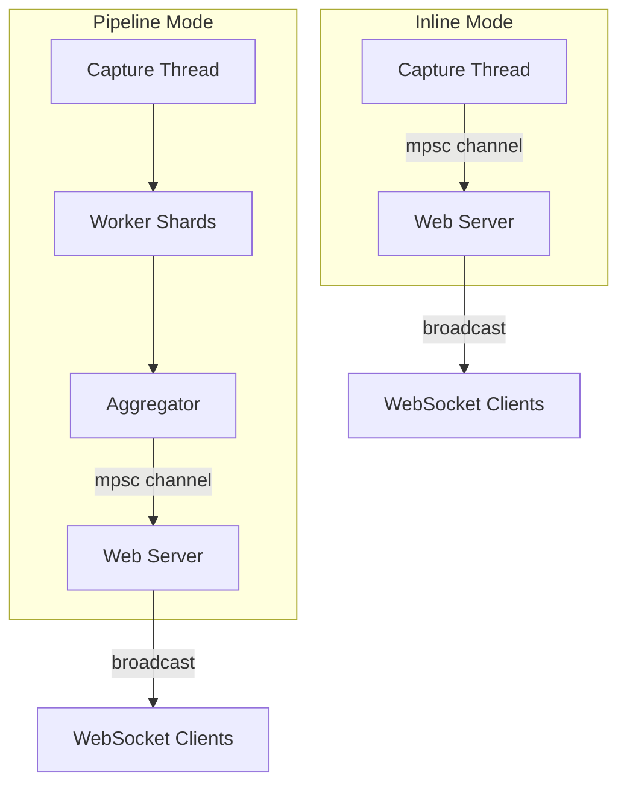

# Web Dashboard

The web dashboard provides a real-time browser interface for monitoring captured traffic. Enable it with `--web` or `[web] enabled = true` in the config file.

```bash
sudo netscope --web --quiet
```

Then open <http://127.0.0.1:8080>.

If TLS is enabled (`[web.tls] enabled = true`), use `https://...` instead.

## Features

- **Stats cards** -- live throughput (Mbps), packet rate (pps), active flow count, alert count, and kernel drop totals.
- **Time-series chart** -- dual-axis throughput and packet rate history.
- **Top flows table** -- ranked by throughput delta per tick, showing protocol, endpoints, rate, total bytes, and TCP state.
- **Packet list** -- sampled packets displayed in real time, newest at top.
- **Packet inspector** -- click any packet to see the full protocol tree (Ethernet / Linux SLL / loopback / raw IP, ARP/IPv4/IPv6, TCP/UDP/ICMP/ICMPv6, DNS for UDP/53, and TLS ClientHello SNI when detected) and hex dump, fetched on demand from the server.
- **Alerts tab** -- real-time anomaly alerts (SYN flood, port scan).
- **Perf overlay** -- open `/?perf=1` to show dashboard fps, render latency p50/p95/p99, dropped frame count, and estimated client/server clock offset.
- **Auto-reconnect** -- the WebSocket reconnects automatically after disconnection.
- **Merged live frames** -- the server batches each tick, sampled packets, and alerts into one websocket `frame` message and replays the latest frame on reconnect / lag recovery.

TLS ClientHello SNI detection is best-effort and packet-level (no TCP reassembly), so split ClientHello messages may not decode. ECH can hide the real SNI, and NetScope only surfaces SNI values that look like valid ASCII hostnames (labels `A-Za-z0-9-`).

## Endpoints

| Path          | Method | Description                                                          |
| ------------- | ------ | -------------------------------------------------------------------- |
| `/`           | GET    | Serves the dashboard HTML (embedded in the binary via `rust-embed`). |
| `/ws`         | GET    | WebSocket endpoint for real-time data.                               |
| `/api/health` | GET    | Health check, returns `200 OK`.                                      |
| `/metrics`    | GET    | Prometheus-compatible metrics in text exposition format.             |

When dashboard auth is enabled (`[web.auth] enabled = true`), all endpoints above require HTTP Basic auth, including `/api/health`, `/metrics`, and the WebSocket handshake.

The dashboard HTML/CSS/JS is embedded into the binary at compile time (no separate frontend build step). Chart.js is vendored under `web/static/vendor/chartjs/` and served locally, so charts render in airgapped/offline environments. The bundle is served at `/vendor/chartjs/chart.umd.min.js`.

Exact UI details live in the embedded frontend assets under `web/static/index.html`, so presentation-specific behavior is implemented there.

## Perf Mode

Open the dashboard with `?perf=1` to enable the performance overlay:

```text
http://127.0.0.1:8080/?perf=1
```

In perf mode, the browser:

- estimates clock offset via app-level WebSocket ping/pong,
- renders stats updates on `requestAnimationFrame` instead of directly inside `onmessage`,
- computes render latency from `server_ts` to the browser render timestamp, and
- displays fps, latency percentiles, dropped frame count, and offset in the header.

For high-rate capture testing, use `tick_ms = 33` and `sample_rate = 0` to focus measurement on the stats/render path rather than the live packet feed.

## Architecture



In both modes, the web server runs in a dedicated thread with its own tokio runtime. It receives events through an `mpsc` channel (capacity 4096) and broadcasts them to all connected WebSocket clients. Packet detail lookups only work while a packet remains in the ring buffer.

### Event Types

The server sends JSON messages to clients, each with a `"type"` field. The current live path uses merged `frame` messages plus a few request/response helpers:

| Type            | Description                                                                                            |
| --------------- | ------------------------------------------------------------------------------------------------------ |
| `hello`         | Sent on connect. Contains `version` and `tick_ms`.                                                     |
| `frame`         | Primary live update message. Contains `frame_seq`, a `tick` payload, and batched `packets` / `alerts`. |
| `packet_detail` | Full protocol tree and hex dump for a specific packet (requested by client).                           |
| `perf_pong`     | Response to client perf probes with echoed `client_ts` and `server_ts`.                                |

Standalone `stats_tick`, `packet_sample`, and `alert` variants still exist in the Rust message enum, but the current server path emits merged `frame` messages for live updates.

Clients can request packet details by sending:

```json
{ "type": "get_packet_detail", "id": 42 }
```

The server looks up the packet in its ring buffer and responds with a `packet_detail` message.

When perf mode is enabled in the browser, the client also sends:

```json
{ "type": "perf_ping", "client_ts": 1710000000000 }
```

The server responds with `perf_pong`, which the client uses to estimate clock offset before computing end-to-end render latency.
Clients dedupe merged frames by `frame_seq` so reconnect / lag recovery does not append duplicate packets or alerts.

## Configuration

| Key             | Default | Description                                                                                                                            |
| --------------- | ------- | -------------------------------------------------------------------------------------------------------------------------------------- |
| `tick_ms`       | `1000`  | How often stats are pushed to clients (milliseconds). Minimum 16ms (use 33ms for ~30fps).                                              |
| `top_n`         | `10`    | Number of top flows included in each stats tick.                                                                                       |
| `packet_buffer` | `2000`  | Ring buffer size for packet detail lookups. Only the most recent N packets are retained.                                               |
| `sample_rate`   | `1`     | Send every Nth packet to the UI. Set to 0 to disable the live packet feed. Increase this at high capture rates to reduce browser load. |
| `payload_bytes` | `256`   | Maximum raw bytes stored per packet for hex dump display.                                                                              |

These can be set in the `[web]` section of the config file. `--web-bind` and `--web-port` are available as CLI flags; the other keys require a config file.

TLS and auth live under `[web.tls]` / `[web.auth]` and can be configured through the config file or via the `--web-tls*` / `--web-auth*` CLI flags (see [CLI appendix](streamlining-plan.md#cli-reference)).

Packet sampling uses the capture-wide packet id, so `sample_rate` is global in both inline and pipeline modes. Packet detail storage is keyed by packet id and remains robust even when events arrive slightly out of order across worker shards. For authoritative defaults, see [Configuration](configuration.md).

Note: the dashboard stores at most `payload_bytes` per packet for the hex dump in packet detail. This does not affect capture `snaplen` or pcap writing.

## Tuning for High Traffic

At high capture rates, the event channel (capacity 4096) can fill, causing dashboard events to be dropped instead of blocking capture. Dropped events are logged at TRACE level (`-vvv`). To reduce load:

1. **Increase `sample_rate`** -- e.g., set to `10` to send only every 10th packet to the UI.
2. **Reduce `top_n`** -- fewer flows per tick means less data serialized per tick.
3. **Increase `tick_ms`** -- less frequent updates reduce WebSocket bandwidth.
4. **Reduce `payload_bytes`** -- smaller hex dumps stored per packet.

In pipeline mode, workers use a fixed-size streaming heavy-hitters tracker to pick top-flow candidates each tick, then recompute exact displayed deltas for the reported flows. The aggregator keeps a larger merged list for CLI stats when `stats.top_flows > web.top_n`, while truncating the dashboard payload separately to `web.top_n`.

## Security

The web server binds to `127.0.0.1` by default. Since NetScope typically runs as root, exposing the dashboard to the network (`--web-bind 0.0.0.0`) should be done with care.

NetScope now supports optional HTTPS (`[web.tls]`) and optional HTTP Basic auth (`[web.auth]`) for the dashboard.

Recommended remote-access baseline:

```toml
[web]
enabled = true
bind = "0.0.0.0"
port = 8443

[web.tls]
enabled = true
cert_path = "/etc/netscope/dashboard.crt"
key_path = "/etc/netscope/dashboard.key"

[web.auth]
enabled = true
username = "netscope"
password_file = "/etc/netscope/dashboard.pass"
```

Notes:

- If auth is enabled without TLS, credentials are sent over cleartext HTTP Basic auth. Use TLS for non-localhost deployments.
- Self-signed certificates are supported; browsers may show an initial certificate warning.
- Auth applies to static pages, `/api/health`, `/metrics`, and `/ws`.
